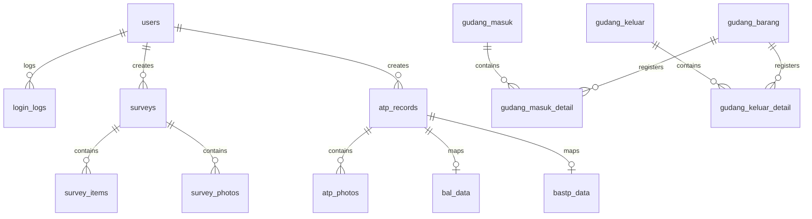

# Database Schema Specifications: Central Monitoring & Evaluation (CME)

This document provides a detailed description of the tables, fields, types, and relationships in the database schema.

---

## 1. Relational Map

The database contains tables organized into five modules: Users, ODC Surveys, ATP Audits, Warehouse Stock, and Reference Instructions.

---

## 2. Table Specifications

### users
Stores user credentials, login access roles, and metadata.
*   `id` (BIGINT, Primary Key, Auto Increment)
*   `username` (VARCHAR(255), Unique) - User identifier for login.
*   `password` (VARCHAR(255)) - BCrypt hashed password.
*   `role` (ENUM('admin', 'surveyor', 'visitor', 'atp', 'staff_cme', 'vendor')) - User access role.
*   `created_at` (TIMESTAMP, Nullable)

### login_logs
Audits user access, session status, and browser fingerprint metadata.
*   `id` (BIGINT, Primary Key, Auto Increment)
*   `username` (VARCHAR(255)) - Username of user trying to authenticate.
*   `status` (VARCHAR(50)) - Verdict of login attempt (`success` or `failed`).
*   `ip_address` (VARCHAR(45)) - Client IP.
*   `user_agent` (TEXT) - Raw user agent string.
*   `browser` (VARCHAR(255)) - Parsed browser name.
*   `os` (VARCHAR(255)) - Parsed operating system.
*   `device` (VARCHAR(255)) - Perangkat device (`Desktop` or `Mobile`).
*   `created_at` (TIMESTAMP, default CURRENT_TIMESTAMP)

### surveys
Main header record for ODC surveyor site reports.
*   `id` (BIGINT, Primary Key, Auto Increment)
*   `nama_site` (VARCHAR(255)) - Site identification name.
*   `tanggal_survey` (DATE) - Physical survey date.
*   `nama_surveyor` (VARCHAR(255)) - Surveyor name.
*   `lokasi` (TEXT, Nullable) - Location description / address.
*   `latitude` (VARCHAR(50), Nullable) - GPS Latitude decimal value.
*   `longitude` (VARCHAR(50), Nullable) - GPS Longitude decimal value.
*   `catatan_tambahan` (TEXT, Nullable) - Surveyor general notes.
*   `created_by` (BIGINT, Foreign Key referencing `users(id)`) - Author identifier.
*   `created_at` (TIMESTAMP, default CURRENT_TIMESTAMP)

### survey_items
Individual checkpoint items within a survey report.
*   `id` (BIGINT, Primary Key, Auto Increment)
*   `survey_id` (BIGINT, Foreign Key referencing `surveys(id)` on delete cascade) - Parent survey.
*   `kategori` (VARCHAR(255)) - Checkpoint category (e.g. Kelistrikan).
*   `nomor_item` (VARCHAR(50)) - Checklist item identifier (e.g. 1.1).
*   `nama_item` (VARCHAR(255)) - Parameter checklist check label.
*   `status_check` (VARCHAR(50)) - Check verification result (`checked` or `cross`).
*   `kondisi_nilai` (TEXT, Nullable) - Specific measurements or custom value.
*   `catatan` (TEXT, Nullable) - Checkpoint specific audit notes.

### survey_photos
Individual photos uploaded for survey checkpoints.
*   `id` (BIGINT, Primary Key, Auto Increment)
*   `survey_id` (BIGINT, Foreign Key referencing `surveys(id)` on delete cascade) - Parent survey.
*   `item_id` (BIGINT, Foreign Key referencing `survey_items(id)` on delete cascade) - Checklist check item.
*   `file_path` (VARCHAR(255)) - Filename on web server disk.

### survey_templates
Structured templates layout configuration for survey checklists.
*   `id` (BIGINT, Primary Key, Auto Increment)
*   `title` (VARCHAR(255)) - Template identifier name.
*   `kategori_json` (LONGTEXT) - Serialized JSON map containing parameters categories and options.
*   `created_by` (BIGINT, Foreign Key referencing `users(id)`) - Author.
*   `created_at` (TIMESTAMP)
*   `updated_at` (TIMESTAMP)

### atp_records
Main header record for RBS Acceptance Test Procedure inspections.
*   `id` (BIGINT, Primary Key, Auto Increment)
*   `nama_site` (VARCHAR(255)) - Site identification name.
*   `tanggal` (DATE) - Inspection date.
*   `region` (VARCHAR(255), Nullable) - Geographic site region.
*   `latitude` (VARCHAR(50), Nullable) - Coordinates lat.
*   `longitude` (VARCHAR(50), Nullable) - Coordinates lng.
*   `no_po` (VARCHAR(100)) - Purchase Order reference.
*   `hasil_json` (LONGTEXT) - Serialized checks state, measurements, text notes, and signatures.
*   `verdict` (ENUM('ACCEPT', 'CONDITIONAL', 'REJECT'), Nullable) - Final site compliance verdict.
*   `verdict_notes` (TEXT, Nullable) - Explanation of verdict conditions.
*   `approval_json` (LONGTEXT, Nullable) - Multi-signature authorization metadata.
*   `bastp_json` (LONGTEXT, Nullable) - Handover details.
*   `created_by` (BIGINT, Foreign Key referencing `users(id)`) - Inspector author.
*   `created_at` (TIMESTAMP, default CURRENT_TIMESTAMP)

### atp_photos
Inspection photos linked to individual ATP check items.
*   `id` (BIGINT, Primary Key, Auto Increment)
*   `atp_id` (BIGINT, Foreign Key referencing `atp_records(id)` on delete cascade) - Parent ATP.
*   `item_id` (VARCHAR(50)) - Checklist item identifier.
*   `file_path` (VARCHAR(255)) - Filename on web server disk.

### atp_templates
Custom template checklists layout configuration for ATP checks.
*   `id` (BIGINT, Primary Key, Auto Increment)
*   `title` (VARCHAR(255))
*   `data_json` (LONGTEXT) - Serialized checklist configuration array.
*   `created_by` (BIGINT, Foreign Key referencing `users(id)`)
*   `created_at` (TIMESTAMP)
*   `updated_at` (TIMESTAMP)

### bal_data
Field Minutes (Berita Acara Lapangan) details associated with ATP.
*   `id` (BIGINT, Primary Key, Auto Increment)
*   `atp_id` (BIGINT, Foreign Key referencing `atp_records(id)` on delete cascade) - Associated ATP.
*   `project` (VARCHAR(255)) - Project identification.
*   `no_po` (VARCHAR(100)) - PO reference.
*   `tanggal_mulai` (DATE) - Commenced date.
*   `tanggal` (DATE) - Concluded date.
*   `pelaksana` (VARCHAR(255)) - Contractor executing project.
*   `lokasi` (VARCHAR(255)) - Location address.
*   `hasil` (TEXT, Nullable) - Recommendations.
*   `pihak1` (VARCHAR(255)) - First Party Company.
*   `pihak2` (VARCHAR(255)) - Second Party Company.
*   `nama1` (VARCHAR(255)) - First Party Representative.
*   `jabatan1` (VARCHAR(255)) - First Party Position.
*   `nama2` (VARCHAR(255)) - Second Party Representative.
*   `jabatan2` (VARCHAR(255)) - Second Party Position.
*   `created_at` (TIMESTAMP)
*   `updated_at` (TIMESTAMP)

### bastp_data
Handover Certificate (BASTP) details associated with ATP.
*   `id` (BIGINT, Primary Key, Auto Increment)
*   `atp_id` (BIGINT, Foreign Key referencing `atp_records(id)` on delete cascade) - Associated ATP.
*   `p1_nama` (VARCHAR(255)) - First Party Representative name.
*   `p1_alamat` (TEXT) - First Party Address.
*   `p2_nama` (VARCHAR(255)) - Second Party Representative.
*   `p2_jabatan` (VARCHAR(255)) - Second Party Position.
*   `p2_alamat` (TEXT) - Second Party Address.
*   `pekerjaan` (TEXT) - Work description scope.
*   `mengetahui1` (VARCHAR(255), Nullable) - Witness I.
*   `mengetahui2` (VARCHAR(255), Nullable) - Witness II.
*   `photos` (TEXT, Nullable) - Associated document attachments list.
*   `created_at` (TIMESTAMP)
*   `updated_at` (TIMESTAMP)

### gudang_barang
Master inventory stock ledger.
*   `id` (BIGINT, Primary Key, Auto Increment)
*   `nama` (VARCHAR(255)) - Material name (e.g. MCB 1P 16A).
*   `kategori` (VARCHAR(255)) - Material type category (e.g. MCB, Baterai, Kabel).
*   `tipe` (VARCHAR(255)) - Detailed spec type (e.g. 1P 16A).
*   `stok` (INT) - Current ledger quantity in stock.
*   `satuan` (VARCHAR(50)) - Base measurement unit (Pcs, Unit, Meter, Batang).
*   `min_stok` (INT) - Minimum stock alert quantity.
*   `created_at` (TIMESTAMP, default CURRENT_TIMESTAMP)

### gudang_masuk
Incoming stock transaction header.
*   `id` (BIGINT, Primary Key, Auto Increment)
*   `no_form` (VARCHAR(100), Unique) - Generated transaction Form ID.
*   `judul` (VARCHAR(255), Nullable) - Batch transaction label.
*   `kategori` (VARCHAR(100), Nullable)
*   `tanggal` (DATE) - Delivery transaction date.
*   `supplier` (VARCHAR(255)) - Distributing supplier.
*   `penerima` (VARCHAR(255)) - Warehouse check receiver.
*   `lokasi` (VARCHAR(100), Nullable) - Specific shelf location.
*   `keterangan` (TEXT, Nullable) - Transaction comments.
*   `foto` (TEXT, Nullable) - Comma-separated list of uploaded note filenames.
*   `diserahkan` (VARCHAR(255), Nullable) - Supplier courier signature name.
*   `diterima` (VARCHAR(255)) - Checker.
*   `created_by` (BIGINT, Foreign Key referencing `users(id)`) - Creator.
*   `created_at` (TIMESTAMP, default CURRENT_TIMESTAMP)

### gudang_masuk_detail
Items detail received in an incoming transaction.
*   `id` (BIGINT, Primary Key, Auto Increment)
*   `masuk_id` (BIGINT, Foreign Key referencing `gudang_masuk(id)` on delete cascade) - Parent transaction.
*   `barang_id` (BIGINT, Foreign Key referencing `gudang_barang(id)`) - Master ledger item.
*   `nama_barang` (VARCHAR(255)) - Material name.
*   `tipe_barang` (VARCHAR(255)) - Specification type.
*   `jumlah` (INT) - Quantity received.
*   `satuan` (VARCHAR(50)) - Base unit.

### gudang_keluar
Outgoing stock transaction header.
*   `id` (BIGINT, Primary Key, Auto Increment)
*   `no_form` (VARCHAR(100), Unique) - Outgoing transaction Form ID.
*   `judul` (VARCHAR(255), Nullable) - Project batch label.
*   `kategori` (VARCHAR(100), Nullable)
*   `tanggal` (DATE) - Release transaction date.
*   `pengambil` (VARCHAR(255)) - Field technician picking up item.
*   `jabatan` (VARCHAR(255), Nullable) - Technician job.
*   `lokasi_tujuan` (VARCHAR(255)) - Destination site ID.
*   `keperluan` (TEXT, Nullable)
*   `proyek` (VARCHAR(255), Nullable) - Project.
*   `tujuan` (VARCHAR(255), Nullable)
*   `keterangan` (TEXT, Nullable) - Remarks.
*   `foto` (TEXT, Nullable) - Comma-separated list of filenames.
*   `disetujui` (VARCHAR(255), Nullable) - Approving manager name.
*   `pengambil_ttd` (VARCHAR(255)) - Signed technician.
*   `created_by` (BIGINT, Foreign Key referencing `users(id)`) - Creator.
*   `created_at` (TIMESTAMP, default CURRENT_TIMESTAMP)

### gudang_keluar_detail
Items detail released in an outgoing transaction.
*   `id` (BIGINT, Primary Key, Auto Increment)
*   `keluar_id` (BIGINT, Foreign Key referencing `gudang_keluar(id)` on delete cascade) - Parent transaction.
*   `barang_id` (BIGINT, Foreign Key referencing `gudang_barang(id)`) - Master ledger item.
*   `nama_barang` (VARCHAR(255)) - Material name.
*   `tipe_barang` (VARCHAR(255)) - Specification type.
*   `jumlah` (INT) - Quantity released.
*   `satuan` (VARCHAR(50)) - Base unit.

### instruction_images
Drawing blueprint image guides for technical categories.
*   `id` (BIGINT, Primary Key, Auto Increment)
*   `kategori` (VARCHAR(255)) - Guide category (e.g. ODC 1 Phase, Shelter CME).
*   `file_path` (VARCHAR(255)) - Filename on web server disk.
*   `created_by` (BIGINT, Foreign Key referencing `users(id)`)
*   `created_at` (TIMESTAMP, default CURRENT_TIMESTAMP)

### instruction_tables
Technical specifications table definitions and Scope of Work (SOW) steps.
*   `id` (BIGINT, Primary Key, Auto Increment)
*   `kategori` (VARCHAR(255)) - Guide category (e.g. ODC 1 Phase).
*   `tipe` (ENUM('spesifikasi', 'sow')) - Parameter guideline type.
*   `data_json` (LONGTEXT) - Serialized parameter specs or step descriptions.
*   `updated_by` (BIGINT, Foreign Key referencing `users(id)`)
*   `created_at` (TIMESTAMP)
*   `updated_at` (TIMESTAMP)
